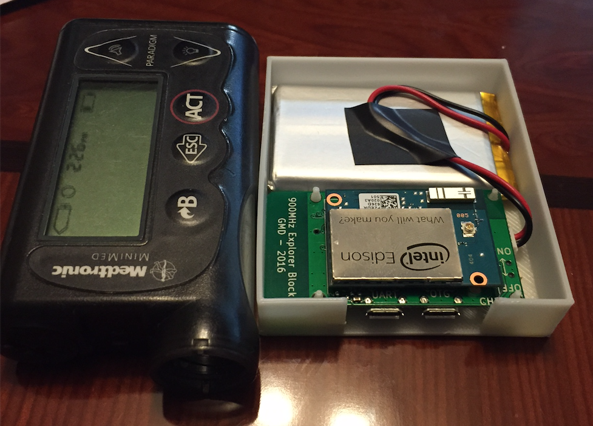

# Explorer Board Case for Intel Edison

The Explorer Board Repository can be found here:

https://github.com/EnhancedRadioDevices/915MHzEdisonExplorer

Here is a picture of the finished 3D printed case:

